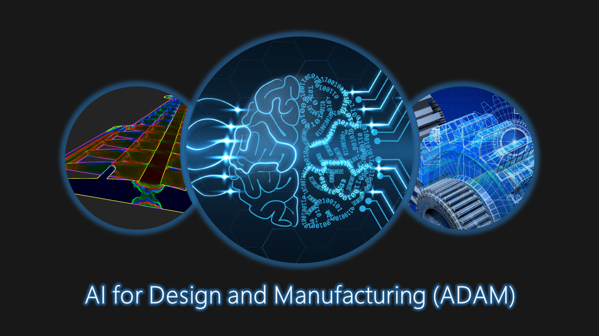

---
# Feel free to add content and custom Front Matter to this file.
# To modify the layout, see https://jekyllrb.com/docs/themes/#overriding-theme-defaults

permalink: /
title: Home
layout: home
---

> ### News and Announcements
> 
> 1. Deadline for submitting lightning talk video and the posters in pdf is **Feb 25, 2022**. Submission link [here](https://iastate.app.box.com/f/43d0ce93d3e64678b7ce958fc9fc4119)
> 2. Deadline for camera-ready workshop paper is **Feb 25, 2022**.
> 

Advances in complex engineering systems such as manufacturing and materials synthesis increasingly seek artificial intelligence/machine learning (AI/ML) solutions to enhance their design, development, and production processes. However, despite increasing interest from various subfields, AI/ML techniques are yet to fulfill their full promise in achieving these advances. Key obstacles include lack of high-quality data, difficulty in embedding complex scientific and engineering knowledge in learning, and the need for high-dimensional design space exploration under constrained budgets.

Our proposed AAAI  workshop, ADAM, aims to bring together researchers from core AI/ML, design, manufacturing, scientific computing, and geometric modeling. Our intent is to facilitate new AI/ML advances for core engineering design, simulation, and manufacturing. Outcomes include outlining the main research challenges in this area, cross-pollinating collaborations between AI researchers and domain experts in engineering design and manufacturing, and sketching open problems of common interest. Specific topics for the workshop include (but are not limited to):

- New theory and fundamentals of AI-aided design and manufacturing 
- Novel AI-based techniques to improve modeling of engineering systems 
- Integration of AI-based approaches with engineering prototyping and manufacturing 
- Novel methods to learn from scarce/sparse, or heterogenous, or multimodal data 
- Novel ML methods in the computational material and physical sciences 
- Novel ML-accelerated optimization for conceptual/detailed system design 
- Novel AI-enabled generative models for system design and manufacturing 
- ML-guided rare event modeling and system uncertainty quantification 
- Development of software, libraries, or benchmark datasets  
- Identification of key challenges and opportunities for future research  

